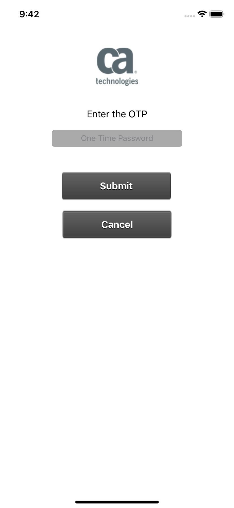
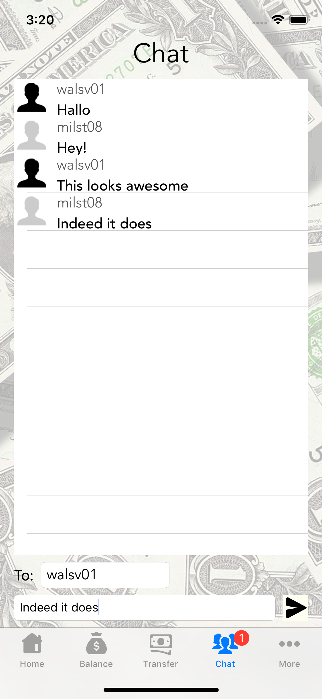

# Mobile API Gateway Demo Banking App

## About
This iPhone app is a demo application for the CA Mobile API Gateway and the corresponding SDK. It can be freely used and changed.

## Prerequesits
In order to run this app XCode >= 9.4 is needed as well as iOS 11 (might work on older versions, not tested). 

As backend a CA Mobile API Gateway needs to be installed and configured. Please update the included msso_config.json to correctly take use of you gateway installation. The demo gateway policies can be found in the MAG Policies folder and should be listening on /mws-team1/account* and /mws-team1/newtransfer

The included msso_config.json will keep working until internal test gateway will be shut down. For credentials to log into an account ask @svenwal here at GitHub.

## Screenshots

## Credits
This app wouldn't have been possible without the following people and projects:

The CA Mobile API Gateway team https://www.ca.com/us/developers/mas.html and https://docops.ca.com/ca-mobile-api-gateway/4-1/en

The awesome "Team 1" :)

Background images from https://www.pexels.com and licensed under the Pexels License https://www.pexels.com/photo-license/  

Icons by https://icons8.com licensed under Creative Commons Attribution-NoDerivs 3.0 Unported